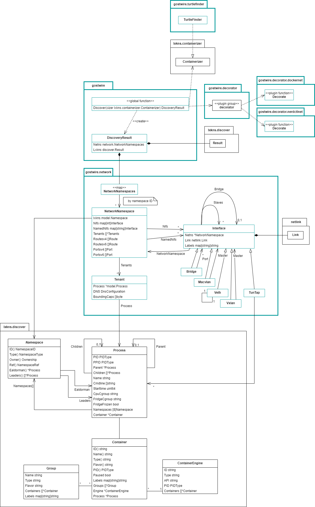

# Architecture

An important aspect of G(h)ostwire's architecture is that it **focuses on
network discovery** and thus **leverages existing open-source Go modules for the
non-focus tasks**:

- Linux-kernel namespace and container discovery via
  [@thediveo/lxkns](https://github.com/thediveo/lxkns)
- background tracking of container workloads via
  [@thediveo/whalewatcher](https://github.com/thediveo/whalewatcher)

Then, G(h)ostwire brings in the specifically network and communication related
discovery aspects, such as (virtual) layer 2 network elements and port
forwarding.

Another feature is G(h)ostwire's **unique container engine discovery** – which
also is nicknamed the "turtles finder" in reminiscence of Terry Pratchett's
[Discworld](https://en.wikipedia.org/wiki/Discworld). This discovery snoops out
container engines from their engine processes, wherever they are.

In several places, G(h)ostwire uses network-related
"[decorators](/terminology?id=decorator)": they detect, for instance Docker and
nerdctl/CNI container networks and thus allow labelling their data-link layer
bridges with the network names.

> [!INFO] In case you wonder about how some types are designed – especially when
> describing the properties and topology of network interfaces – then please see
> [embedding](embedding) for background information on why "embedding" isn't any
> substitute for "inheritance".

## Information Model

Very simply spoken, G(h)ostwire is a network-centric discovery service, it is
**centered around network namespaces (~network/IP stacks)** and **their
interconnections**. In addition, **processes** are attached to these network
namespaces. And then there are **containers** related to these processes. And
the **containers then are grouped** in various combinations. Last but not least,
containers are managed by **container engines**.

At a high level this now looks like this, but don't despair: we'll give you a
general walk-through.

Please note that Gostwire-specific classes/types are shown in petrol.

## Discovery

Discovering all networking in a Linux host, including the parts inside
containers, actually requires more discovery steps than "just" discovering the
network elements. In fact, in order to discover all network elements everywhere,
we need to discover all network namespaces for this, and only then can query the
Linux kernel for the network configuration within each network namespace
individually. But discovering network namespaces requires discovering processes
first. And from the processes we can also discover container engines and their
API endpoints.

Probably totally counter-intuitive, we barely ask container engines for
network-related information. The exemptions are the names of Docker networks.
Instead, container engines mostly supply Ghostwire with the information about
which processes are associated with named containers.

And due to the relationship between processes and containers, as well as
processes and network namespaces we can finally relate the network topology and
other details to containers, totally independent of the limited network view of
container engines.

A call to `gostwire.Discover()` returns a `gostwire.DiscoveryResult`. This
result then contains a map of network namespaces, indexed by the namespace IDs
and pointing to Gostwire's `network.NetworkNamespace` type.

Technically, Gostwire's discovery inside `gostwire.Discover()` consists of two
main phases (no neutral, no protective earth required):

1. network _namespaces_ and container discovery (including decoration) under the
   control of the OpenSource `lxkns` module. However, the container discovery is
   in part managed by Gostwire, as it auto-detects container engines, see the
   "Turtle Finder" section below.

   1. **lxkns:** discover the process tree and network namespaces (but not the
      configuration inside network namespaces),
   2. **lxkns:** discover containers and then decorate them:
      1. **Gostwire:** container engine discovery by a Turtle Finder as well as engine-hierarchy detection,
      2. **whalewatcher:** container workload queries, based on the auto-detected
          container engines sniffed out by the Turtle Finder,
      3. **Gostwire:** container hierarchy labelling.
      4. **lxkns:** container decoration (for instance, Docker-composer groups and
          Kubernetes pods, et cetera),

2. network _topology_ and network _configuration_ discovery now under the sole
   control of **Gostwire**.

   1. discover inside network namespaces: interfaces, configuration, relations,
      ...
   2. network decoration, such as for Docker-managed networks and
      nerdctl-managed CNI networks.

## Network Stacks

Each Gostwire `network.NetworkNamespace` repesents a "network stack" with its
network-related configuration:

- the `network.Interface`s,
- IP route configuration (contrary to public belief, routes do not belong to
  network interfaces, but to the stack itself),
- transport layer connectivity (ports/sockets),
- the so-called "tenants" (`network.Tenant`), that is, processes with associated
  information, such as DNS client configuration and the process' bounding
  capabilities.

## Network Interfaces

A Gostwire `network.Interface` describes an individual network interface with
several attributes, such as its name, interface index, MAC address, assigned IP
addresses, et cetera.

The topology of network interfaces is also represented, via interface
relationships, such as the owning bridge, an VETH peer network interface, the
underlay/master interface of a VXLAN, the master of a MACVLAN, et cetera.

## Tenants/Processes

A Ghostwire `network.Tenant` is a process that is:
- either **topmost in the process tree of a network namespace**,
- and/or **topmost in the process tree of a container** and attached to this
  particular network namespace.

In consequence, a some of the tenants of a network namespace might not be
topmost in the process tree with respect to the network namespace, but deeper
inside it.

For each tenant, Gostwire discovers the name and DNS client configuration, such
as the hostname (differentiated between system-set hostname and
`/etc/hostname`), `/etc/resolv.conf`, et cetera. This information depends on a
tenant's/process' UTS and mount namespaces. This discovery aids in diagnosing
communication problems, and especially name resolving issues.

For more process details a Gostwire `network.Tenant` refers to its
`model.Process` counterpart from the OpenSource `lxkns` module. This reference
is important as it relates tenants to containers. But please keep in mind that
not every tenant is also a container.

## Containers, Groups, Engines

A lxkns `model.Container` stores information about containers, such as their
`ID`s and `name`s (which are two separate concepts), types (Docker, containerd,
...), and more.

Containers can be grouped and they can be grouped into several groups at the
same time. Typical group types are Kubernetes _pods_ and Docker-composer
_projects_.

Finally, containers are associated with a simple description of their managing
container engine, such as the engine's `ID`, `Type` and `API` endpoint path.

> [!NOTE] When using Gostwire's `TurtleFinder` the `API` endpoint paths are
> always `/proc/[PID]/root/...`-based paths that can be used from processes,
> regardless of their current mount namespaces.

## Turtle Finder

Gostwire's unique `turtlefinder.TurtleFinder` auto-detects container engines in
the process tree and then continously watches their container workload in the
background. Additionally, the hierarchy of container engines is detected, such
as when operating a container engine inside a container in case of [Kubernetes
in Docker (KinD)](https://github.com/kubernetes-sigs/kind).

The `TurtleFinder` implements the lxkns interface `containerizer.Containerizer`
with the logic to auto-detect container engine processes and then querying their
container workload. This interface is called as part of the discovery process,
and as part of the `lxkns`-controlled discovery phase in particular.

> [!NOTE] The auto-discovery of container engines cannot be run in the
> background, but only on-demand as part of a `ghostwire.Discover()` call. The
> catch here is that when detecting a new container engine it takes a non-zero
> amount of time to synchronize to that engine's container workload. Gostwire
> thus waits for up to 2s for such initial synchronizations to succeed (it waits
> in parallel, so the maximum delay is always 2s, regardless of number of newly
> discovered engines), before proceeding into the container and network
> discovery.

After the `lxkns`-controlled container discovery and decoration phase has
finshed, the `TurtleFinder` finishes by labelling containers with a so-called
prefix label based on the container engine hierarchy.

## Network Decorators

Gostwire's network decorators are run over the discovered network namespaces and
container engines (thus including tenants, containers, ...). Sub-packages of
`gostwire.decorator` implement decoration of network interfaces based on
container-mananged networks. At this time, container engine-level networks for
Docker and nerdctl/CNI are implemented.
