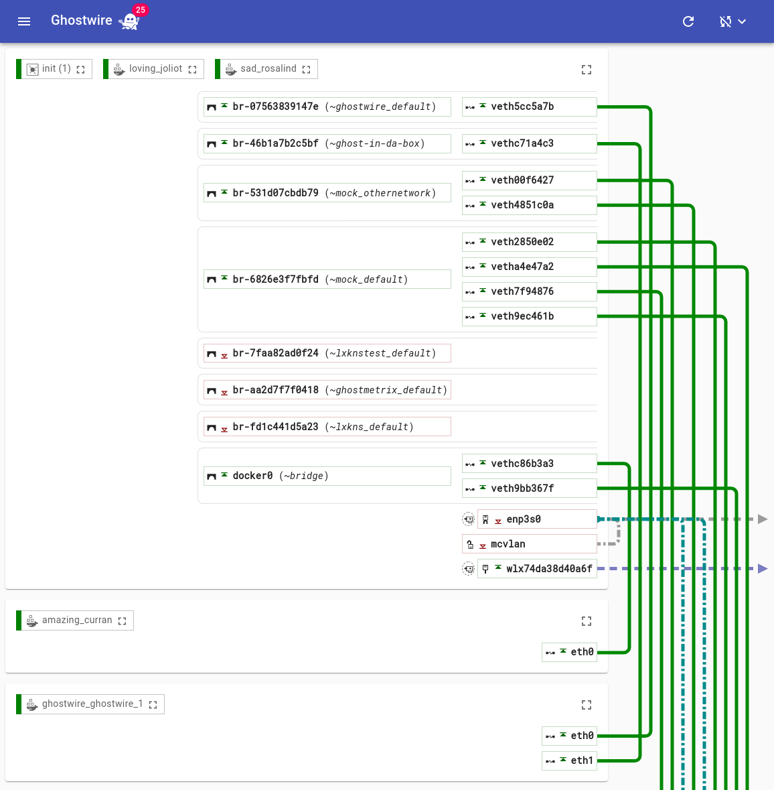
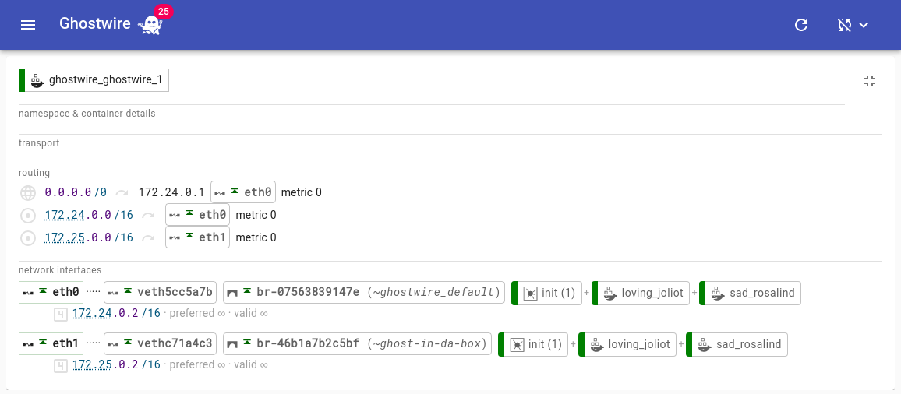
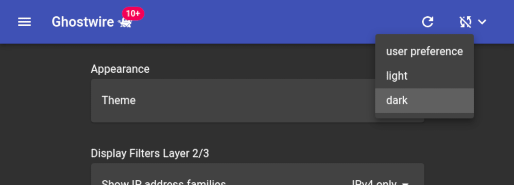

# Ghostwire Web App

The **new** Ghostwire UI incarnation "mark II", as a single-page web
application and using the discovery REST API directly.

- This iteration of the Ghostwire UI has been completely written from scratch
  and developed using the component-based [React](https://reactjs.org/) ("*A
  JavaScript* [sic!] *library for building user interfaces*").

- The UI uses [Material-UI](https://material-ui.com/) React components for its
  basic (and not-so-basic) UI elements.

- Yet, the new UI bases on all the good stuff of Ghostwire's original ... *erm*
  ... "ghost" extendis on it. The wiring display is more prominent than ever, as
  is the overall structure of the communication detail information display.
  However, care has been taken to incorporate many lessons learnt while using
  the first-generation Ghostwire UI.

## User Features

- Ghostwire's trademark **wiring display finally is now the default view** for
  first-time visitors.

- **dark mode**: users can switch between light and dark theme; defaults to
  picking up the user's browser/OS preference, when available.

- detail views now list **container labels**.

- improved navigation using **"permanent" URLs** and **⛶ "zoom" buttons**: users
  can now focus on (zoom into) the communication details of a particular
  container or network namespace, even when stopping and restarting them without
  loosing their focused view. These URLs (specific displays) can be bookmarked.

- improved [KinD/Kubernetes IN Docker](https://kind.sigs.k8s.io/) support that shows
  and sorts Kubernetes namespaces by their KinD cluster names in the navigation
  drawer. Also supports multiple KinD clusters simultaneously.

- **discovery refresh without reloading the page** or application. Only those
  parts in the UI update when discovery information changes.

- either manual or **automatic refresh**; users can easily choose between
  different refresh intervals in the UI.

- **filter settings are now persistent.** They are stored in browser local
  storage and apply per Ghostwire service host.

- integrated **extensive help manual**.

- improved, **cleaner design incorporating Material Design**; dynamically
  themable.

- **animations** ... rocking wires and bubbling capture buttons!

- many small UI improvements to reduce clutter and to make the amount of
  information displayed better manageable.

## Technical Merits

- the UI completely gets client-side rendered (as opposed to the v1
  server-side HTML rendering). It uses the server side only for reading the
  web app and for making discovery API REST calls. This offloads rendering to
  the clients, relieving "edgy" server systems and giving mobile device users
  pleasingly warm hands.

- UI components can be viewed and worked upon independently of the complete
  application in form of a "UI style guide". Please see below for details.

- the component architecture of React improves development and maintenance of
  the Ghostwire UI. Additionally, the UI can now draw from several large eco
  systems, such as the React and Typescript eco systems.

## Eye Candy

### Wiring View

In case you still wonder: the number display in the badge hovering above our
Ghostwire mascot is the number of discovered virtual IP stacks (that is,
network namespaces).

### Detail View

Users can now easily view the communication configuration of a single
container, for instance, by clicking on a container name in the wiring view.
These detail views possess their own (quasi) permanent URLs, so they can even
be bookmarked. Some day, we might even add "like" buttons.

### Dark Mode

Go to settings and switch the theme.

## TODO

- [ ] complete VxlanDetails.
- [ ] Kubernetes (KinD) mock data.
- [ ] TAPTUN support.
- [ ] decouple specific discovery method from `discovery` component.

## Serving from Different URLs (Paths)

The Ghostwire UI is...

1. an SPA – **S**ingle **P**age **A**pplication,
2. and uses (React) DOM routing, where the UI has multiple URL paths which
   select the particular view to be shown.

As the same SPA has multiple URL paths, this needs some help on the side of the
application server in order to correctly handle user bookmarking individual URL
paths and reloading from any view. Regardless of the URL path, the server must
serve the same `index.html` for kickstarting the app; yet at the same time, this
app must be able to correctly reference all its further assets, such as the app
Javascript code (chunks), browser favicon, et cetera – even from sub
directories.

In principle, this situation can be handled using the HTML `<base href="...">`
element: it specifies for all *relative* URLs the base URL – *basename* – to
address relative to. (Please watch pitfalls when using query-only and hash-only
URLs, as these are also subject to the base URL).

In case of the Ghostwire UI there are unfortunately an important complication:
the same UI must be deployable using different base URLs *at the same time*, so
it's not possible to create a fixed build. For instance, on an Industrial Edge
Device (IED) the Ghostwire UI should be reachable via:

1. directly at port `:5001` (Edgeshark packet capture service),
2. at `/edgeshark` behind an IED's reverse proxy.

The solution deployed by our Ghostwire UI is thus as follows:

- `package.json` declares `"homepage": "."`.
- `public/index.html` now references all assets...
  - ...*in the production build* using relative URLs, such as
    `./static/js/main.hash.chunk.js`. This is important in order to correctly
    reference assets behind different base URLs.
  - ...*during development* using absolute URL paths, such as
    `/static/js/main.hash.chunk.js`. This is fine for serving via `yarn start`
    with its development server.
- moreover, `public/index.html` sets the base URL of the app...
  - ...*in the production build* as `<base href="./" />`. While this looks, erm,
    counter-productive we'll fix this when serving `index.html` from the
    Ghostwire service by replacing it on-the-fly with the correct base URL.
    > The takeaway message here is that the Ghostwire server must dynamically
    > rewrite the base href settings depending on the (original!) URL on which
    > `index.html` gets served.
  - ...*during development* as `<base href="/" />`, where it matches with what
    the development server uses as the base URL.
- for our `<Router>` component (DOM router) we pick up the base ("basename") as
  defined in `index.html` and use it for correctly setting the `basename`
  property: this ensures that the router component correctly figures out the
  app-local view path from the current URL. See `utils/basename` for how the
  basename value gets derived from the `<base href="...">` element.

## Development

- `nodejs` and `yarn` (nodejs package manager) installed. `yarn` can be
  installed via `npm`, the nodejs package manager. And yes, you need `yarn`
  and not just plain `npm`.

- to read and develop individual Ghostwire UI components outside the full-blown
  application: `yarn styleguidist`, then navigate to <http://localhost:6060>.

- to develop and serve the Ghostwire UI web app: `yarn start`, make sure you
  have the Ghostwire service running on port 5000 and then navigate to
  <http://localhost:3000> (sic!) to load the new Ghostwire web app.

- to develop and test the static build serving with correct base href handling
  behind rewriting proxies, run both
  
  `python3 -m fakegw.server`
  
  `python3 -m fakegw.ingress`,
  
  then navigate to <http://localhost:5556> to see how things break – hopefully
  they do not!

- to build a static distributable in `build/`: `yarn build`.

## Ghostwire Discovery Information Model

The UI uses its own discovery information model which is closely modelled after
the Ghostwire discovery service API information model. However, the UI's model
is geared towards efficient navigation between on objects the model is made of.
For instance, while network namespace reference their embraced (primitive)
containees, these containees also back-reference the network namespace they're
contained (well, confined) in.

For more details, please refer to the introduction in the live style guide:
`yarn styleguide` is your friend here.

## No Redux

You might wonder why the UI implementation doesn't use
[Redux](https://redux.js.org/)? As it is, the Redux architecture cannot handle
recursive state information: yet Ghostwire's discovery information model makes
heavy use of (indirect) recursive object references, such as between network
namespaces and containees, between namespaces and network interfaces, between
related network interfaces, et cetera. This allows fast navigation on the
discovery information. Using Redux would required a complete remodelling with
questionable outcome, making navigation on the information model awkward and
extremely cumbersome.

## Overall Project Structure

- `src/`
  - `app/` – the App component which stitches everything together. The chaos
    starts here. The individual views are to be found in `views/`.
  - `components/` – many, many nice React components making up Ghostwire's new
    UI. Please see below on a list of OpenSource components used in this
    project, and their licenses.
  - `hooks/` – useful React hooks.
  - `icons/` – Typescript'ed SVG icons for immediate use in the UI; please note
    that we don't package the SVG icon source files directly, but instead use
    only their SVG paths and cleanly re-package them. See `yarn icons` as well
    as the top-level `icon/` directory for details.
  - `models/gw/` – Ghostwire's information model, ready for easy navigation
    because it has the JSON textual references resolved into JS object
    references. Also contains the conversion from JSON into the final and easily
    navigatable object mess.
  - `utils/` – misc. non-component things.
  - `views/` – the individual views/routes of the Ghostwire UI.
- `public/` – static assets needed for the Ghostwire UI when generating a static
  build as well as running the development server.
- `build/` – the output directory for a static build after running `yarn build`.
- `fakegw/` – contains development helpers in form of a static build and
  discovery API server (note: needs a running Ghostwire instance) as well as a
  rewriting proxy server. They are used to test the general mechanics of
  handling dynamic base hrefs.
- `icons/` – icon SVG sources. Please note that these sources are not directly
  included in the web bundle. In the sources, we use Typescript SvgIcon
  components instead. These are generated from the SVG icon sources in this
  directory by running `yarn icons` in the repository top-level directory.
- `images/` – app screenshots. Please note that the app icons are to be found in
  `icons/` instead.
- `mock/` – supplemental stuff to set up a set of example containers with weird
  wirings. Also to be used for generating mock discovery data from such a
  running example configuration.
- `styleguidist/` – support code to allow viewing and developing Ghostwire's UI
  components using the [React
  Styleguidist](https://github.com/styleguidist/react-styleguidist). Use `yarn
  styleguidist` to start the Styleguidist server, then connect your browser to
  port `6060`.

## Licenses

- The Ghostwire client UI is Copyright (c) Siemens AG 2023 and licensed under the MIT License, see also [LICENSE](../LICENSE).
- The following components are open source components from the
  [lxkns](https://github.com/thediveo/lxkns) project, and have been licensed
  under the MIT License to this project:
  - `stlyeguidist/`
    - `ComponentCard`
    - `MuiThemeWrapper`
  - `components/`
    - `appbardrawer/`
    - `discovery/`
    - `dynvars/`
    - `extlink/`
    - `helpviewer/`
    - `idcontext/`
    - `muimarkdown/`
    - `refresher/`
  - `hooks/id/`
  
- The `hooks/interval` component bases on the code snippet from
  <https://overreacted.io/making-setinterval-declarative-with-react-hooks/> is
  licensed under the MIT license, see:
  <https://github.com/gaearon/overreacted.io/blob/master/LICENSE-code-snippets>.

## Useful Survival References

- [React Typescript
  Cheatsheet](https://react-typescript-cheatsheet.netlify.app/docs/basic/setup/)
- Jake Archibald's SVG Optimizer with the missing GUI for optimizing bloated SVG
  files: [SVGOMG](https://jakearchibald.github.io/svgomg/)
